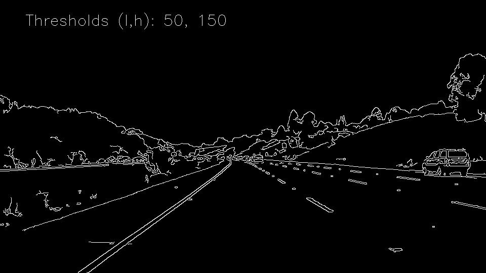
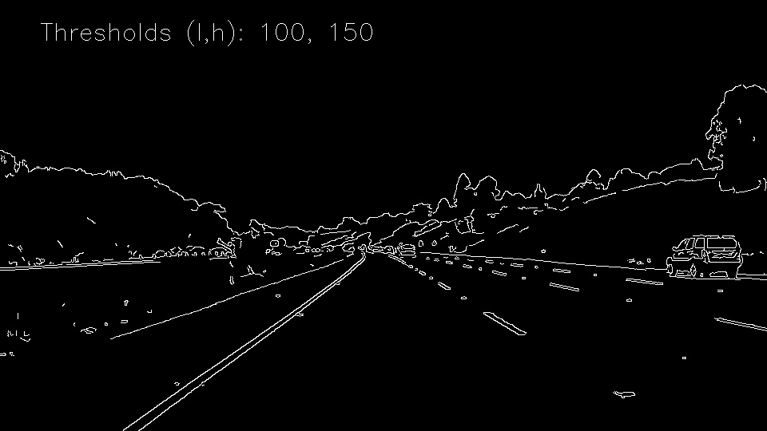
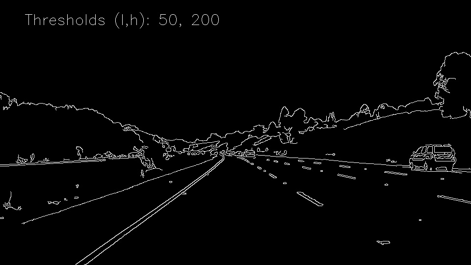
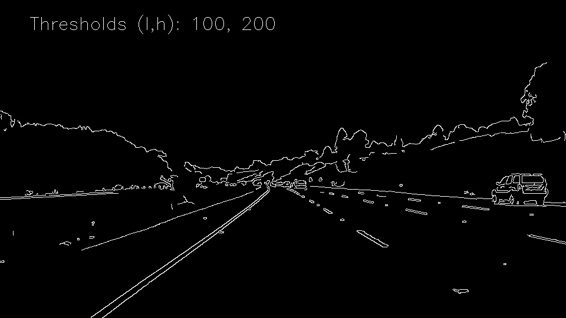
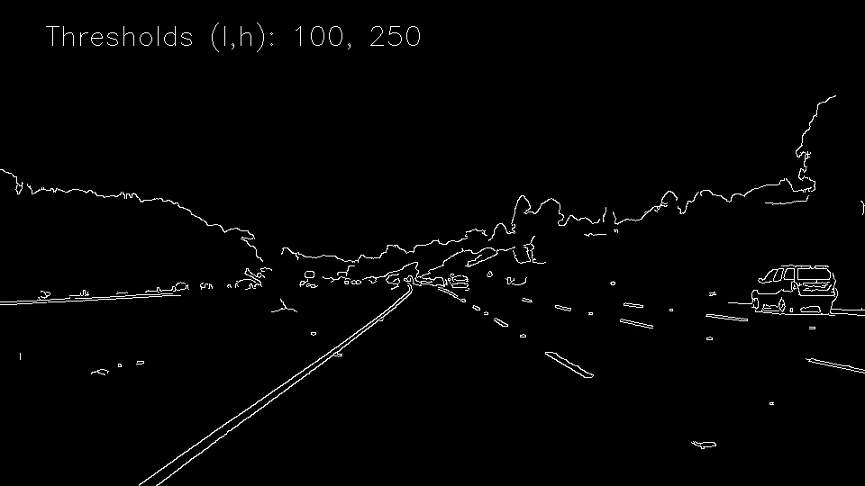
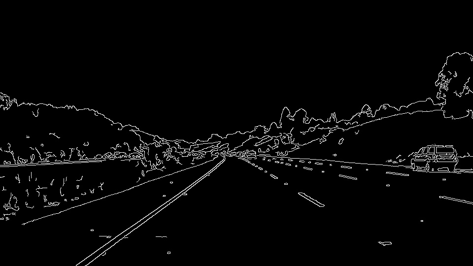

# **Finding Lane Lines on the Road** 

## 1. Pipeline to detect lanes

Image processing pipeline consists of the following steps:

* Read original image
* Apply a filter to retrieve image information in one layer
* Apply Canny filter edge detection 
* Keep edges in the area where road is expected
* Lines are detected from the segments using `Probabilistic Hough Transform`
* Lanes are identified from lines
* Detected lines are added to the original image

We will start  on the processing part starting with the application Canny filter for edge detection. 

### Filter Image

Canny filter requires single layer image. This means that we need to apply a filter or extract a single layer first. 

The simplest option is to convert image into a greyscale image:

Original Image | Greyscale Single Layer
:--------:|:--------:
|

In some conditions this will not be the best filter for the lane detection. 
One alternative is described in the the Challenge section of this report.

### Edge Detection 

Canny filter is an out of the box transformation of the image with just two parameters that can be tuned for a given problem. 

I have done tuning using list of lower and upper thresholds to pick best parameters. 

Thresholds | Lower 50 | Lower 100 | Lower 150
:-------|:--------------------------:|:--------------------------:|:--------------------------:
Upper 150 | |  | 
Upper 200 | |  | 
Upper 250 | |  | 

Canny edge detection algorithm is very robust with a picture taken in good light condition.
Thresholds don't impact the outcome for the next steps and we can comfortably choose values applying subjective judgment.

This can become a problem with a wider range of images taken in different weather and light conditions, 
where we would potentially need to detect which conditions picture was taken in from and use parameters that are more appropriate.

During this exercise it was important for me to try to do tuning in a way that will allow me to repeat it later at scale
on other images. I have been trying different options of displaying multiple images with annotations in Jupiter Notebook. 
I came up with a way of combining image output with markdown which makes it very simple to build and customise. 

It is also possible to automatically estimate optimal thresholds for the algorithm with Otsu's method. 
In my pipeline I have opted for applying this method to simplify image detection on images taken in different 
conditions or where the color range was changed by a filter.

### Limiting the view

Camera mounted on the car has a wide angle and will capture objects outside of the road. 

Knowing where the road and lane segments are likely to be is very helpful to remove irrelevant edges which will
add noise at the line detection step. 

Base on the image and the geometry of image perspective I have chosen to reduce detection to a triangle area as shown 
on the first image:

Road View Filter | Original Image | Filtered View
:-------|:----:|:-------:
||

I have written a function `limit_view()` that sets values outside of the view to 0. 

This function has several parameters, one of which allows to change the position of the top middle point in the view. 

In the future it would be useful to detect that point or even the whole road segment as it might change its position 
based on the road angle and cars direction. 

Separation of the function is important for pipeline maintainability and future development. 
Right now it is possibly implemented in a suboptimal way which can be improved without any changes to the pipeline itself. 

### Line Detection

Line detection step finds lines on the image using `HoughLinesP()` function from OpenCV library. 

This stage has required significant amount of trial-and-error tuning due the number of parameters
that this algorithm has. 

I have used information about the lines from the example image to make sure that whole line if possible is detected,
as opposed to multiple segments on a single line. 

This step will require further turning using multiple images potentially and tuning report similar to edge detection stage 
will be beneficial.

### Lanes

This step compensates for the shortcomings of the Line Detection, especially for the broken lines or road turns. 

Lanes are combined from lines where if the following two conditions are true:

 - Angle between lines is less than 5 degrees;
 - Distance between the lowers points of the extended lines is less than 1/30 of the image width.
 
After potential lanes are identified, they are filtered for these conditions:

 - Angle of the lane must be over 25 degrees;
 - Projections of the lines contributing to the lane on Y axis should cover 25% of lanes height.

## 2. Pipeline shortcomings

The first shortcoming of the pipeline is that it is build based on the image that was taken in great weather conditions on 
a flat straight motorway with the paint in a good condition. Neither the car or other traffic are crossing the lanes. 

This means that pipeline was not really tested for a wide range of real cases and was not written in a way that 
would allow to inspect or tag large amount of images. 

Specific issues that can be expected for the first version of the pipeline are:

* Canny edge detection is applied to the whole image rather than to the filtered view. This could affect optimal
thresholds and reduce edge detection quality for the area of interest.

* Line detection falls short for broken lines which can be potentially improved through heuristic approaches. 
  For example if we have high confidence from one solid line, we could use that information to improve our confidence about broken lines.

* View area is filtered out with `for` loop, which can be suboptimal in terms of speed. In general this pipeline was written without
 any non-functional requirements in mind and can fail from memory or CPU issues once code is ported to the real system. 
 
* Line detection has been only tested on the straight road, with sharp turn on the road it might not work, and this is something
that we probably will need to address by allowing for shorter line segments or through additional transformation of the image that 
would allow detect road lines still.

## 3. Suggest possible improvements to your pipeline

Depending on the primary use of the pipeline there are several directions for improvements that can be taken.

### Performance

Pipeline has not been tested for any non-functional requirements and that would be an obvious areay of 
improvement if code is to be ported to process video in real time for example.

### Research Scalability

Pipeline was written to process a single image, but to facilitate it would be great to be able to process 
hundreds of tagged images taken in different conditions and compare pipeline output to existing tags. 

### Edge Detection

Despite the fact that edge detection seems to be very stable on the test images, it would be benefitial to understand
how it changes in Fog, Rain and Night conditions. If there is an impact on the result, we would need to add a step
to detect these conditions and change algorithm parameters dynamically. 

### View Filter

Current implementation is based on a specific view of the camera and proportions of the road to above the road area. 
This can change and we would want to have a step in the pipeline that detects the area of the road first and view filter is 
adjusted dynamically. 

### Line Detection

Line detection can be improved in many ways, for example:
- We could apply knowledge about one line to fill the gaps if information is missing for another line as we know the are 
parallel and can be extrapolated based on the perspective geometry. 
- We could use information from previous images to extrapolate the gaps in the segments as the road view changes gradually.

## 4. Challenge

Challenge Video has confirmed following pipeline shortcomings:

 - Yellow lane was not detected where paint was in bad condition;
 - Road turns introduced some jitter in lane detection;
 - Change in road surface introduced line segments going across the road;
 
 In addition to that:
 - Shadows and trees along the road introduced additional segments;

In response to the challenge I have introduced the following changes to the original algorithm:

 - Segments are detected from the saturation layer of HSV representation of the image
 - Lines are combined in lanes by weighted averaging lines;